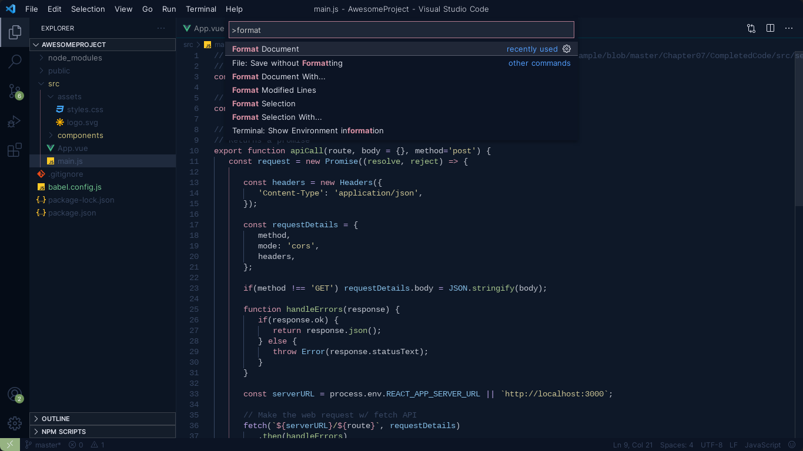

# Jelly Gummy Theme for [Visual Studio Code](http://code.visualstudio.com) 

> A yummy VS Code theme with soft colors for your precious eyes.

## Preview

**Jelly Gummy**

**Panel Terminal**

**Command Palette**

## Installation
1. Go to View-> `Command Palette` or `press Ctrl+Shift+P`. 
1. Type `Install Extension` to open up the extensions menu.
1. Search for `Jelly Gummy`. 
1. Click `Install` and reload VS Code to make the theme available.
1. Open the Command Palette again and type `Color Theme` to set Jelly Gummy as the theme.

## License
[MIT License](./LICENSE)
